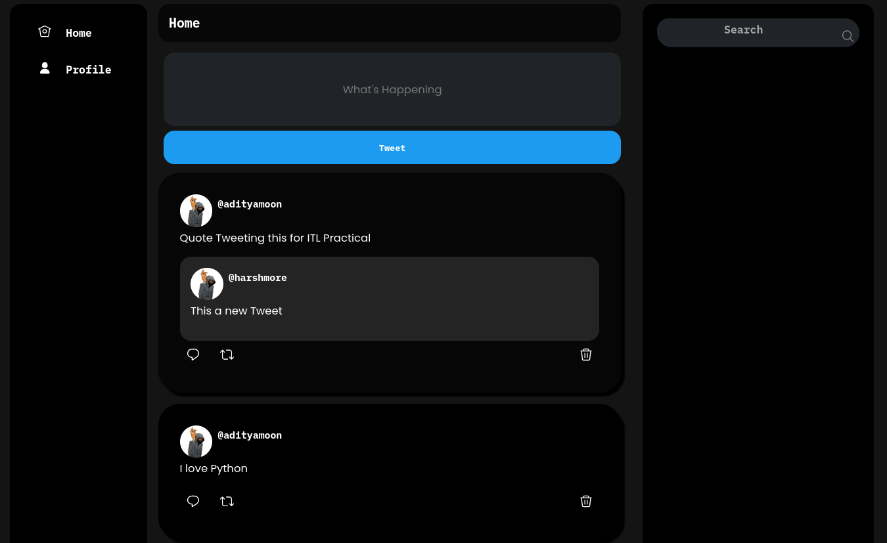
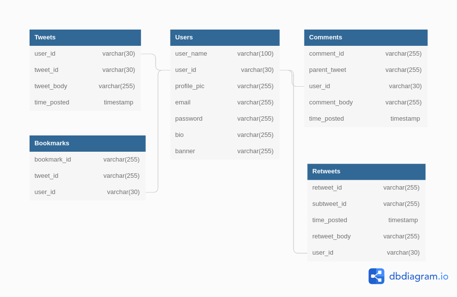

# twitter-clone

Django Twitter Clone

## Database Design

### API EndPoints

- `home/`
- `user/<str:user_id>`
- `create_tweet/`
- `tweet/<str:tweet_id>`
- `comment_on_tweet/`
- `login/`
- `signin/`
- `retweet/<str:subtweet_id>`
- `retweet/`
- `follow/`
- `delete/<str:tweet_id>`
